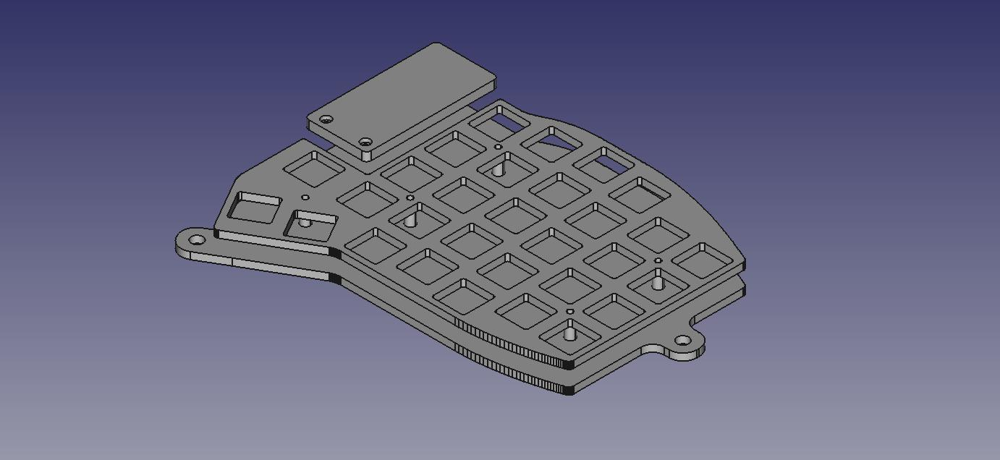

# Kimiko tenting plates

Basically the same as the offical ones with a little extension.

The wings on the outside can be use with m5 screws to tent the Kimiko. Adding dipping rubber to the screw heads is a good idea.
I used my cnc mill to cut the plates from 3mm acryllic. The display windowpane is made of 4mm acryllic. In case one wants to cut the windowpane oneself, do not forget to mirror the pane for the second half.
If you want to print the bottom part (the one with the distance holders), do not forget to mirror this part, too. For surface finishing reasons the top part might need to be mirrored in case one wants to print it.
All other parts do not need to be mirrored.

And now a picture of the finished plates:

